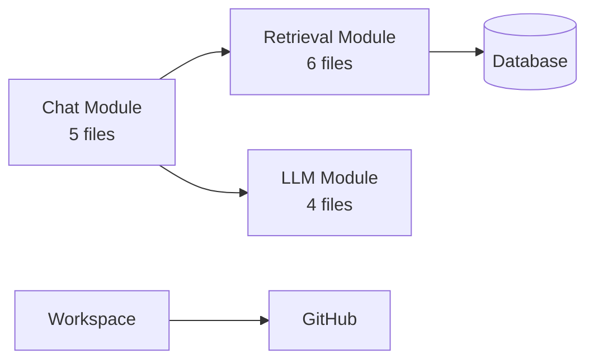
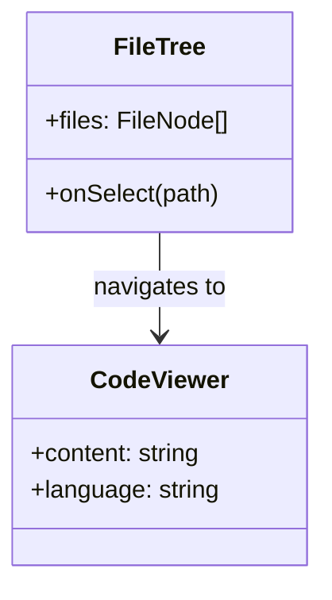
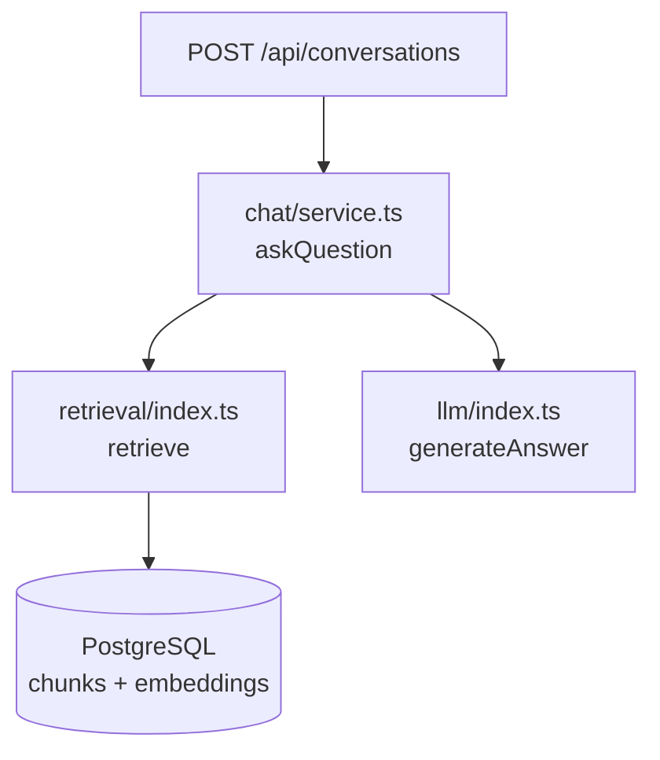

# Job 10: Living Architecture Diagrams

## Summary
Auto-generate interactive architecture diagrams (component diagram, module dependency diagram, data flow diagram) from the symbol graph. Diagrams are always current because they're generated from the indexed data. Click any box to jump to the code. Uses Mermaid.js for rendering — no heavy dependencies.

## Size: L (~5h)

## Dependencies: None

## What to Build

### 1. Diagram Generation Module
Create `src/modules/architecture/`

#### diagram-generator.ts — Core generator
```typescript
type DiagramType = "module-dependency" | "component" | "data-flow" | "class-hierarchy";

interface DiagramNode {
  id: string;
  label: string;
  type: "module" | "file" | "class" | "function" | "api-route" | "database" | "external";
  filePath?: string;
  symbolId?: string;
  metadata?: Record<string, string>;
}

interface DiagramEdge {
  from: string;
  to: string;
  label?: string;
  type: "imports" | "calls" | "extends" | "implements" | "data-flow" | "http";
}

interface GeneratedDiagram {
  type: DiagramType;
  title: string;
  description: string;
  mermaidCode: string; // Mermaid syntax
  nodes: DiagramNode[]; // for click-to-code mapping
  edges: DiagramEdge[];
}

async function generateDiagram(
  repoConnectionId: string,
  diagramType: DiagramType,
  options?: { focusPath?: string; maxDepth?: number; maxNodes?: number }
): Promise<GeneratedDiagram>
```

**Diagram implementations:**

#### Module Dependency Diagram
Groups files by top-level directory (module), shows inter-module dependencies.

1. Query files grouped by first path segment: `src/modules/chat/`, `src/modules/retrieval/`, etc.
2. For each module pair, count symbol_relations crossing module boundaries
3. Generate Mermaid graph:

4. Edge thickness proportional to dependency count
5. Node size proportional to file count

#### Component Diagram
Shows classes/interfaces and their relationships.

1. Query symbols of kind class, interface, type
2. Query symbol_relations of type extends, implements
3. Generate Mermaid class diagram:


#### Data Flow Diagram
Traces data from API routes through services to database.

1. Identify API route files (path contains `/api/`)
2. For each route, follow symbol_relations (calls chain) through service → queries → DB
3. Generate Mermaid flowchart:


#### Class Hierarchy Diagram
Shows inheritance and implementation chains.

1. Query symbols with kind class/interface
2. Query symbol_relations with type extends/implements
3. Render as Mermaid class diagram with inheritance arrows

#### queries.ts — DB queries for diagram data
```typescript
async function getModuleDependencies(repoConnectionId: string): Promise<ModuleDep[]>
async function getClassHierarchy(repoConnectionId: string): Promise<ClassNode[]>
async function getCallChains(repoConnectionId: string, entrySymbolId: string, maxDepth: number): Promise<CallChain[]>
```

### 2. API Route

#### GET /api/workspaces/[workspaceId]/repos/[repoId]/architecture
Query: `?type=module-dependency` | `component` | `data-flow` | `class-hierarchy`
Optional: `&focus=src/modules/chat` (filter to sub-tree)

Response:
```json
{
  "diagram": {
    "type": "module-dependency",
    "title": "Module Dependencies",
    "description": "How modules depend on each other",
    "mermaidCode": "graph LR\n  ...",
    "nodes": [...],
    "edges": [...]
  },
  "cached": true
}
```

Cache in Redis for 10 min.

Create: `src/app/api/workspaces/[workspaceId]/repos/[repoId]/architecture/route.ts`

### 3. UI — Architecture Page
Create `src/app/workspace/[workspaceId]/architecture/page.tsx`

#### ArchitectureView (`src/components/architecture/architecture-view.tsx`)
Main view component.

**Top bar:**
- Diagram type selector: tabs for "Modules" | "Components" | "Data Flow" | "Class Hierarchy"
- Focus filter: text input to narrow to specific path/module
- "Refresh" button to regenerate

**Main area — Mermaid diagram:**
- Use `mermaid` npm package to render SVG
- Diagram fills available space
- Zoom controls: zoom in/out/fit
- Pan: drag to move around

**Click-to-code:**
- When user clicks a node in the diagram:
  1. Look up node in the `nodes` array
  2. If it has a `filePath`, navigate to code viewer with that file
  3. If it has a `symbolId`, scroll to that symbol's line

**Side panel (on node click):**
- Shows: node name, type, file path, related symbols
- "Open in Code Viewer" button
- List of connections (incoming/outgoing)

**Loading state:**
- Skeleton diagram placeholder while generating

#### MermaidRenderer (`src/components/architecture/mermaid-renderer.tsx`)
Wrapper component that:
1. Takes mermaid code string
2. Calls `mermaid.render()` to produce SVG
3. Injects SVG into a div
4. Adds click handlers to nodes (mermaid supports `click` callbacks)

```typescript
interface MermaidRendererProps {
  code: string;
  onNodeClick?: (nodeId: string) => void;
}
```

**Important**: Initialize mermaid on client side only (dynamic import, no SSR):
```typescript
"use client";
import { useEffect, useRef } from "react";

// Dynamic import to avoid SSR issues
const initMermaid = async () => {
  const mermaid = (await import("mermaid")).default;
  mermaid.initialize({ startOnLoad: false, theme: "dark" });
  return mermaid;
};
```

#### DiagramLegend (`src/components/architecture/diagram-legend.tsx`)
Color/shape legend for the diagram.

### 4. Integration
- Add "Architecture" to sidebar nav with a diagram icon
- Most important nav item after Explorer

## Files to Create
- `src/modules/architecture/diagram-generator.ts`
- `src/modules/architecture/queries.ts`
- `src/app/api/workspaces/[workspaceId]/repos/[repoId]/architecture/route.ts`
- `src/app/workspace/[workspaceId]/architecture/page.tsx`
- `src/components/architecture/architecture-view.tsx`
- `src/components/architecture/mermaid-renderer.tsx`
- `src/components/architecture/diagram-legend.tsx`

## Files to Modify
- `src/components/layout/sidebar-nav.tsx` — Add "Architecture" nav item (if exists)

## NPM Packages to Install
- `mermaid` (client-side diagram rendering)

## Acceptance Criteria
1. Architecture page loads at `/workspace/{wId}/architecture`
2. Module dependency diagram renders correctly showing inter-module deps
3. Component diagram shows classes/interfaces with relationships
4. Data flow diagram traces API routes → services → DB
5. Clicking a node in any diagram navigates to the code
6. Diagram type tabs switch between views
7. Diagrams are generated from real symbol data (not hardcoded)
8. Mermaid renders on client side without SSR errors
9. Results cached in Redis
10. `npm run build` passes

## What NOT to Do
- Do not use D3.js (Mermaid is sufficient and lighter)
- Do not generate diagrams during indexing (on-demand only)
- Do not add diagram editing (read-only visualization)
- Do not add diagram export to PNG/PDF (future enhancement)
- Do not modify the ingestion pipeline
